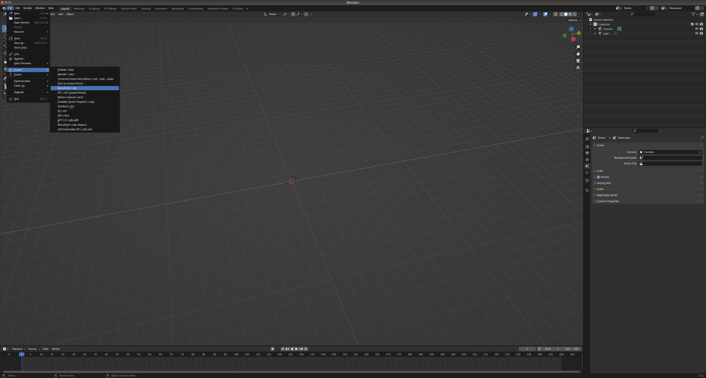
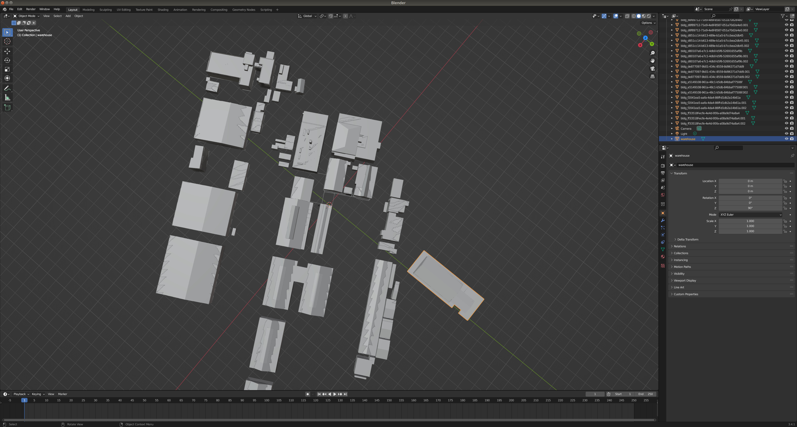
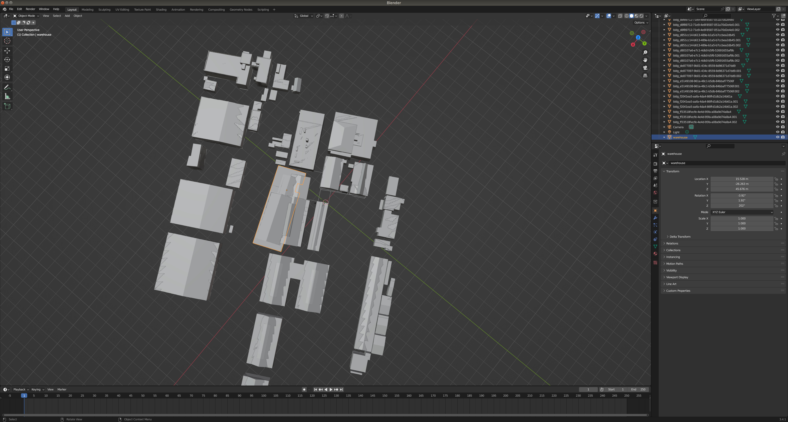
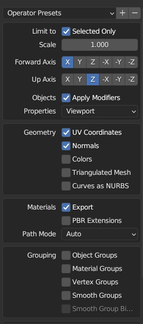
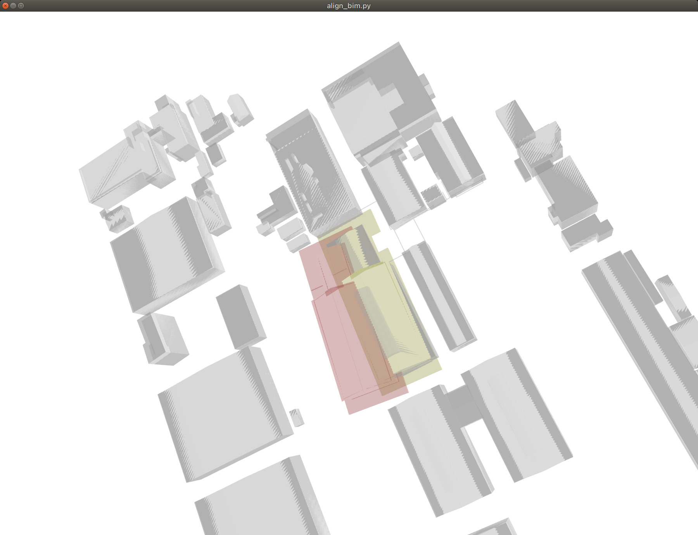
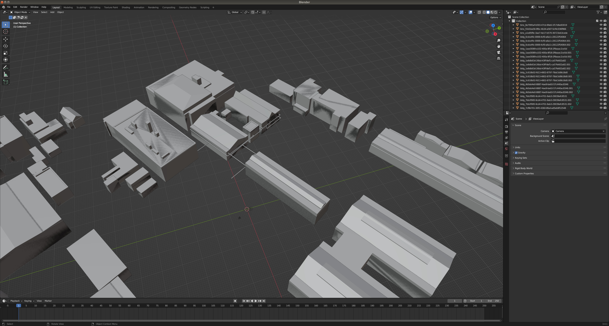
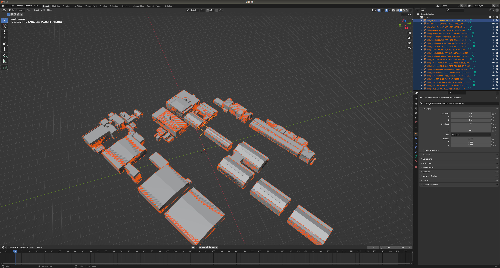
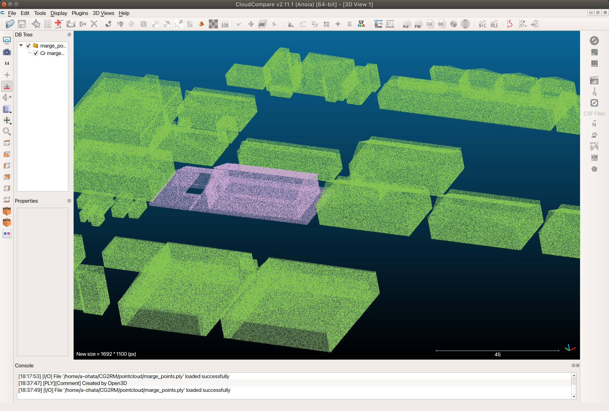

# サンプルデータを使ったテスト手順

### 手順概要

1. CityGMLをobjに変換
2. CityGML生成したobjを点群化
3. BIM(ifc)をobjに変換 
4. CityGMLとBIMの位置合わせを行う(パターン１、パターン２)  
5. CityGML生成したobjから特定の建物を取り除く 
6. 複数の点群を一つの点群にまとめる

(sample_resource内のzipファイルを全て解凍してください)

### 1. CityGMLをobjに変換
```
# conver building information
python gml2obj.py -s ./sample_resource/city_gml/udx/ --lat 35.4987030455 --lon 139.72337047 --alt 38.5293235779 --mapcode_level third

```
```
# convert dem （Digital Elevation Model）
python gml2obj.py -s ./sample_resource/city_gml/udx/dem/533915_dem_6697.gml --lat 35.4987030455 --lon 139.72337047 --alt 38.5293235779
```


### 2. CityGML生成したobjを点群化
```
python create_sampling_point_cloud.py -f $HOME/CG2RM/obj/53391597_bldg_6697.obj  --density 10  
python create_sampling_point_cloud.py -f $HOME/CG2RM/obj/533915_dem_6697.obj  --density 1 -x 250 -y 250 

```

### 3. BIM(ifc)をobjに変換 
```
./IfcConvert sample_resource/bim/warehouse.ifc ~/CG2RM/obj/warehouse.obj
```


### 4. CityGMLとBIMの位置合わせを行う　(パターン１)
blender を使ってある程度位置合わせた後、プログラムによるCityGMLとBIMの位置合わせを行います

blender を使ってある程度位置合わせを行う
[File]>[Import]>[Wavefront(.obj)]



Up Axis をZにする


対象の建築物を選択



対象の建築物を移動（移動方法はBlenderの[操作方法参照](https://docs.blender.org/manual/ja/2.93/scene_layout/object/editing/transform/move.html)）



[File]>[Export]>[Wavefront(.obj)]  

  

Up AxisをZにして　warehouse_trans.obj　という名前で保存。"$HOME/CG2RM/obj"に移動させる

プログラムによる位置合わせを行います。 下記コマンドを実行することでCityGMLが持つ座標系に合うように位置調整したBIMが結果として得られます。  
モデルの形状の違いなどの要因により自動調整には限界があります。うまく一致しない場合はBlenderなどのソフトを使って手動で調整する方が良い結果を得られる可能性があります。

```
python create_sampling_point_cloud.py -f $HOME/CG2RM/obj/warehouse_trans.obj --density 10  
python align_bim.py --source ~/CG2RM/pointcloud/warehouse_trans_sample.ply --target ~/CG2RM/pointcloud/53391597_bldg_6697_sample.ply  
```



赤く表示されているモデルは初期位置。黄色く表示されているモデルはプログラムにより自動調整された後のモデル位置。
位置変換後の結果obj,ply,pcdは"~/CG2RM/transformed"内に保存されます。

### 4. CityGMLとBIMの位置合わせを行う　(パターン２)
事前にBlenderを使って手動で位置合わせしたモデルを使います
```
# ./sample_resource/bim/warehouse_trans.obj は事前にblenderで位置調整したモデルです。
python create_sampling_point_cloud.py -f ./sample_resource/bim/warehouse_trans.obj --density 10  

```

### 5. CityGML生成したobjから特定の建物を取り除く　

blender UI上で削除対象建築物を左クリックで選択  

  

[delete]keyで削除  

  

[A]を押すと残りのオブジェクト全選択
　　
  

[File]>[Export]>[Wavefront(.obj)]  

  

Up AxisをZにして　53391597_bldg_6697_removed.obj　という名前で"$HOME/CG2RM/obj/"に保存

特定の建築物を取り除いたObjの点群を生成します
```
python create_sampling_point_cloud.py -f $HOME/CG2RM/obj/53391597_bldg_6697_removed.obj  --density 10
```

### 6. 複数の点群をマージする
```
python merge_multi_point_cloud.py -f ~/CG2RM/pointcloud/warehouse_trans_sample.pcd ~/CG2RM/pointcloud/53391597_bldg_6697_removed_sample.pcd ~/CG2RM/pointcloud/533915_dem_6697_sample.pcd
```

  

