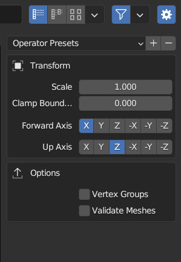
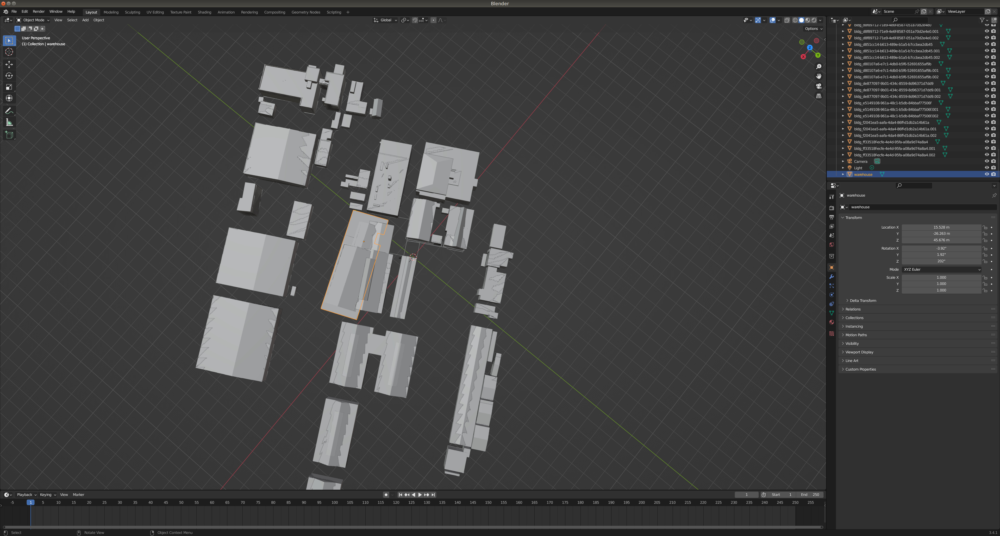
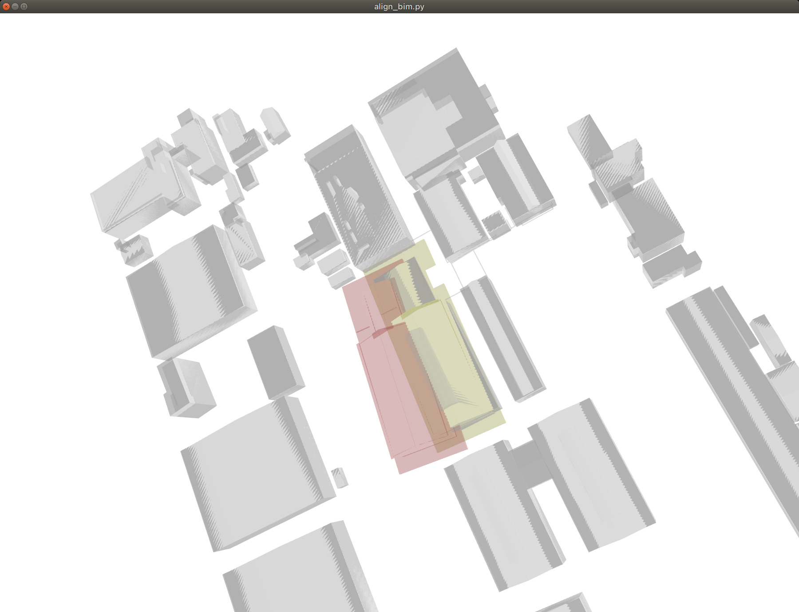
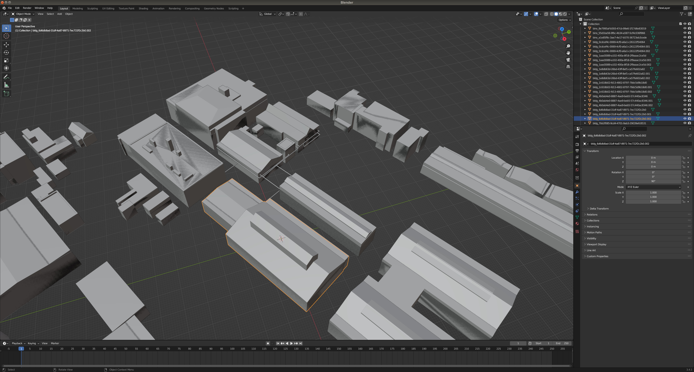

### サンプルデータを使ったGityGMltoRobotoMapの使用方法を解説します。

1. CityGMLをobjに変換
2. obj から点群生成
3. BIM(ifc)をobjに変換 
4. CityGMLとBIMの位置合わせを行う   
5. 複数の点群を一つの点群にまとめる


(sample_resource内のzipファイルを全て解凍してください)

### CityGMLをobjに変換
```
# conver building information
python gml2obj.py -s ./sample_resource/city_gml/udx/ --lat 35.4987030455 --lon 139.72337047 --alt 38.5293235779 --mapcode_level third

```
```
# convert dem （Digital Elevation Model）
python gml2obj.py -s ./sample_resource/city_gml/udx/dem/533915_dem_6697.gml --lat 35.4987030455 --lon 139.72337047 --alt 38.5293235779
```

### BIM(ifc)をobjに変換 
```
./IfcConvert sample_resource/bim/warehouse.ifc sample_resource/bim/warehouse.obj

mv sample_resource/bim/warehouse.obj ~/CG2RM/obj/
```


### blender を使ってある程度位置合わせ
import obj into blender






### obj から点群生成
```
python create_sampling_point_cloud.py -f $HOME/CG2RM/obj/53391597_bldg_6697.obj ./sample_resource/bim/warehouse_trans.obj --density 10  
python create_sampling_point_cloud.py -f $HOME/CG2RM/obj/533915_dem_6697.obj  --density 0.1  
```
### CityGMLとBIMの位置合わせを行う 
```
python align_bim.py --source ~/CG2RM/pointcloud/warehouse_trans_sample.ply --target ~/CG2RM/pointcloud/53391597_bldg_6697_sample.ply  
```

赤く表示されているモデルは初期位置。黄色く表示されているモデルはプログラムにより自動調整された後のモデル位置。

### 元の都市モデル　objから特定の建物を取り除く　
blender UI上で削除対象建築物を左クリックで選択  
  
[delete]keyで削除  

[A]を押すと残りのオブジェクト全選択　　
  
[File]>[Export]>[Wavefront(.obj)]  

特定の建築物を取り除いたObjの点群を生成
```
python create_sampling_point_cloud.py -f $HOME/CG2RM/obj/53391597_bldg_6697_removed.obj  --density 10
```

### 複数の点群をマージする
```
python merge_multi_point_cloud.py -f ~/CG2RM/pointcloud/warehouse_trans_sample.pcd ~/CG2RM/pointcloud/53391597_bldg_6697_removed_sample.pcd
```
